# MESGuard

<div align="center">

面向客服、实施和现场人员的业务问题整理与智能排查系统。

MESGuard 将客户工单、只读业务数据和企业知识资料组织为可追溯的排查过程，并生成可供开发人员继续处理的交接摘要。

[](https://go.dev/)
[](https://react.dev/)
[](https://www.postgresql.org/)
[](https://www.rabbitmq.com/)
[](LICENSE)

[文档](docs/README.md) · [开发指南](docs/development.md) · [系统架构](docs/design/system-architecture.md) · [评测记录](docs/evaluations/README.md)

</div>

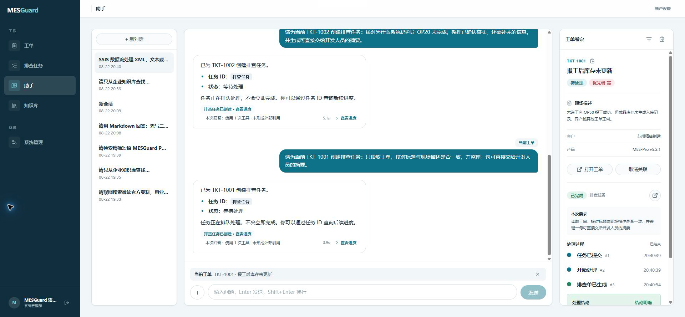

## Overview

MESGuard 围绕“客户问题如何可靠地交给开发处理”组织工作流：业务人员可以在统一助手中查询企业知识、关联工单并发起排查任务；Agent 在冻结的权限范围内读取资料和业务数据；异步 Worker 执行调查，最终在工单卷宗中保留过程、证据状态和报告。

系统不会在证据不足时强行给出确定结论。排查任务的执行状态与报告的结论状态相互独立：任务可以成功完成，同时报告明确标记为 `inconclusive`。

## Interface

### Unified assistant workflow

统一助手支持知识问答、工单关联和排查任务创建。任务提交后，右侧工单卷宗通过 SSE 更新处理过程和报告结论。

<p align="center">
  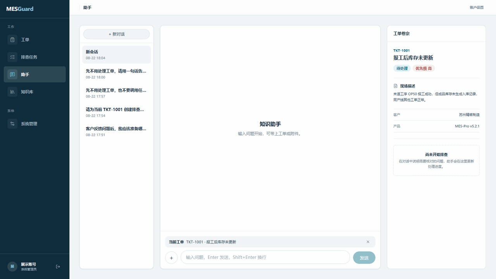
</p>

### Knowledge and operations

<table>
  <tr>
    <td width="50%" valign="top">
      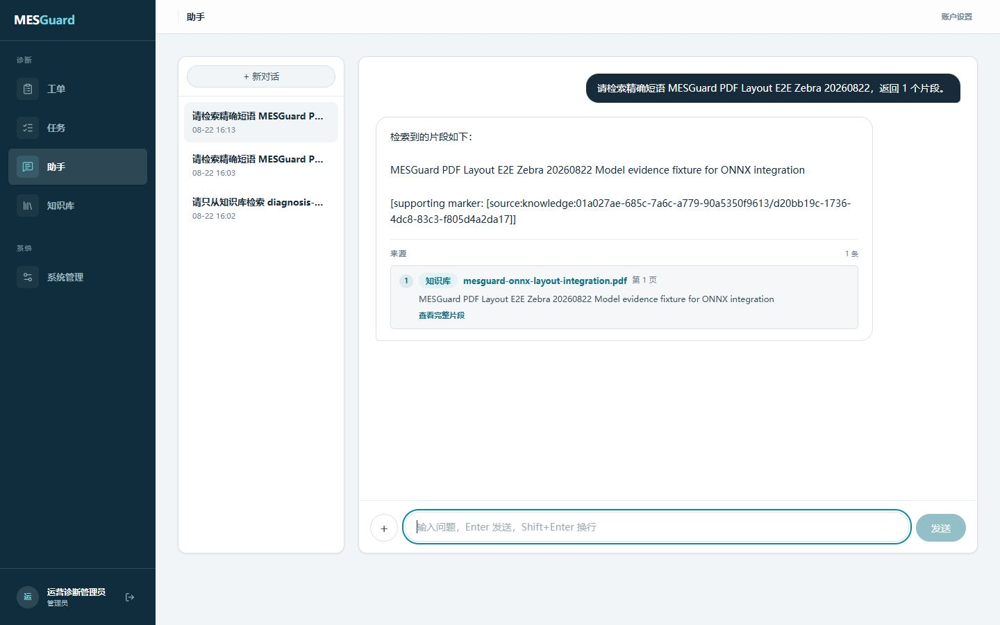
      <br />
      <sub>知识问答与文档引用</sub>
    </td>
    <td width="50%" valign="top">
      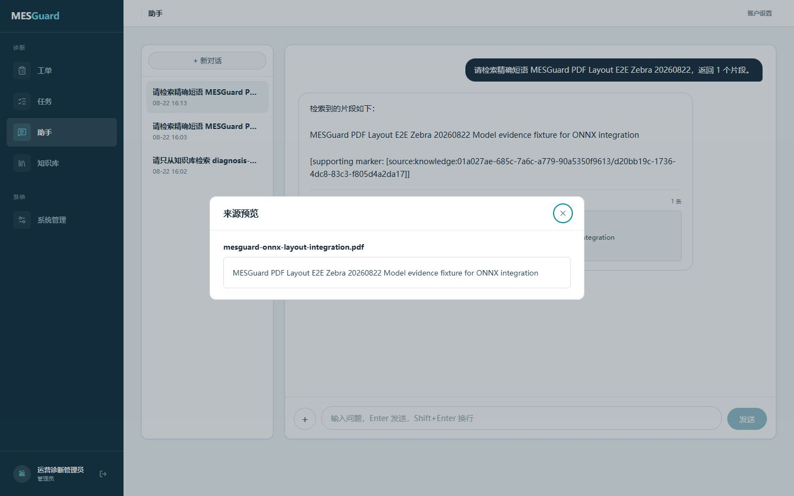
      <br />
      <sub>来源片段预览</sub>
    </td>
  </tr>
  <tr>
    <td width="50%" valign="top">
      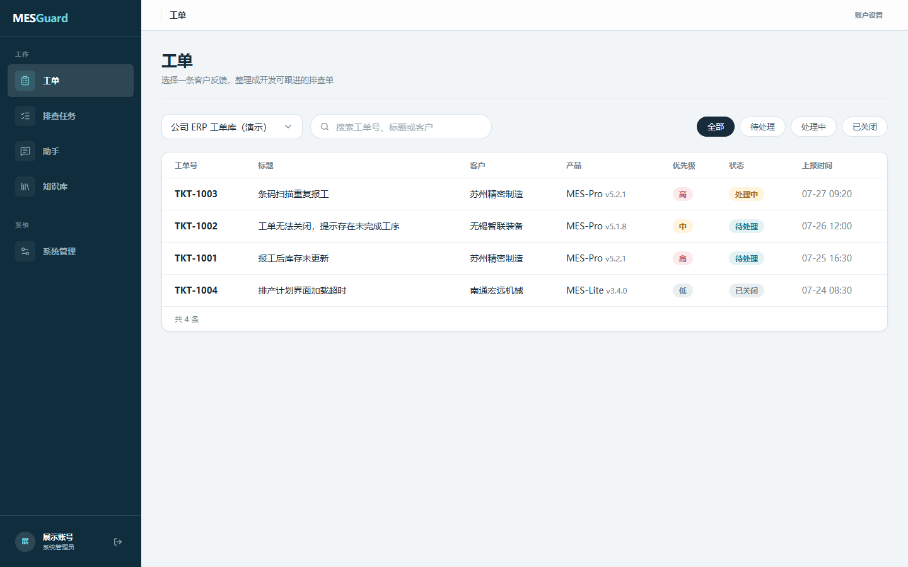
      <br />
      <sub>工单列表</sub>
    </td>
    <td width="50%" valign="top">
      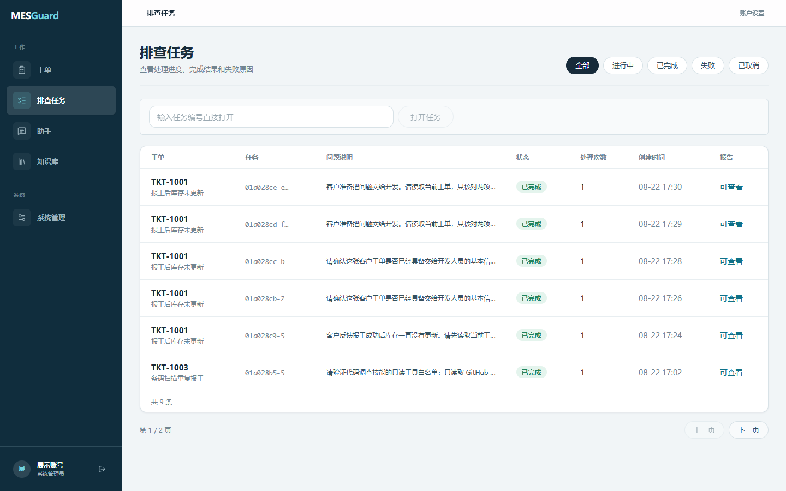
      <br />
      <sub>排查任务与状态筛选</sub>
    </td>
  </tr>
  <tr>
    <td width="50%" valign="top">
      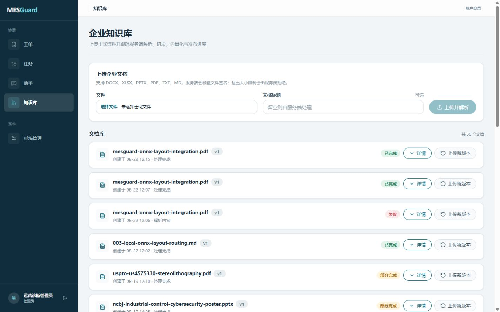
      <br />
      <sub>知识文档与解析任务</sub>
    </td>
    <td width="50%" valign="top">
      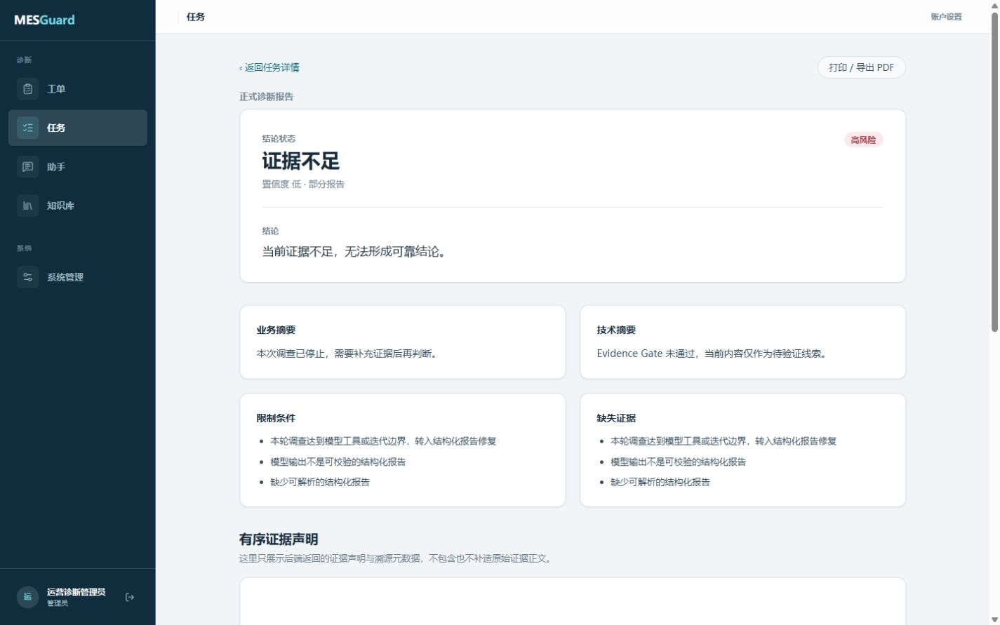
      <br />
      <sub>排查报告与证据状态</sub>
    </td>
  </tr>
</table>

<details>
<summary>Additional system views</summary>

<table>
  <tr>
    <td width="50%" valign="top">
      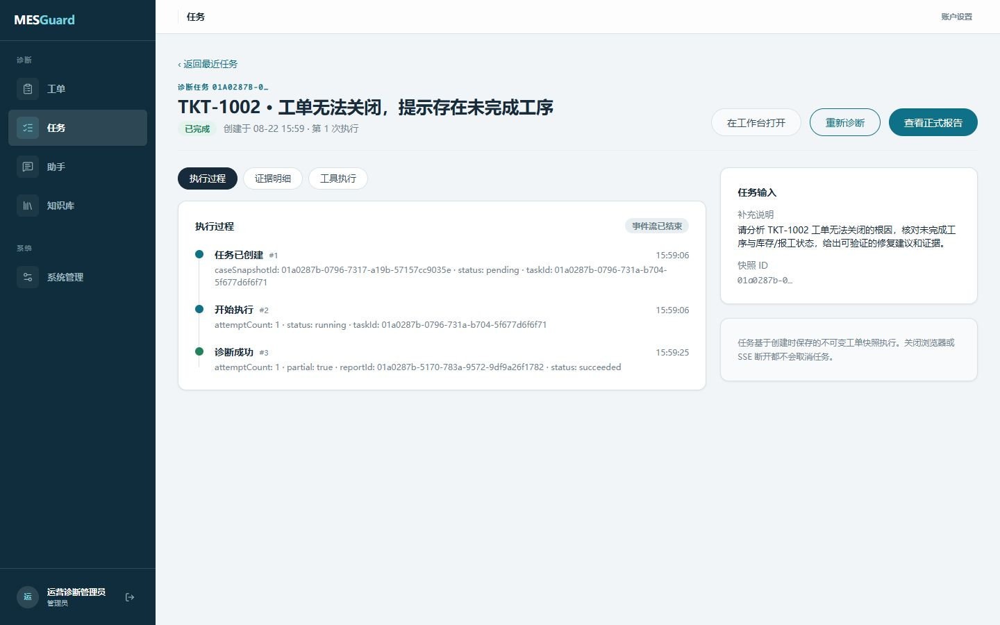
      <br />
      <sub>任务详情与执行时间线</sub>
    </td>
    <td width="50%" valign="top">
      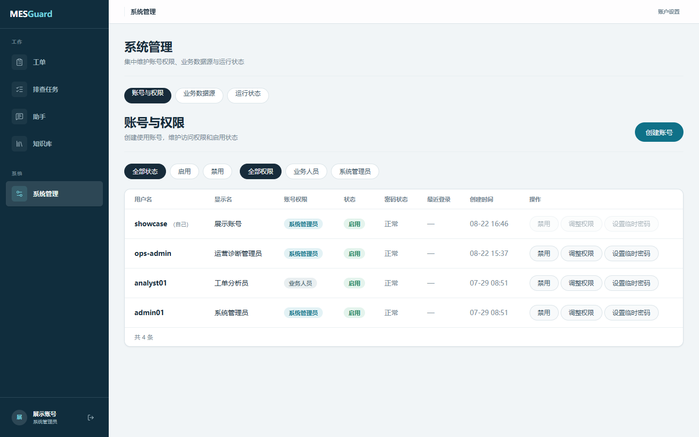
      <br />
      <sub>用户与权限管理</sub>
    </td>
  </tr>
</table>

</details>

## Core capabilities

- **统一会话工作台**：会话、知识问答、工单选择和排查卷宗集中在同一界面；模型回答支持 Markdown、附件和可展开引用。
- **可见的 Agent 活动**：运行期间展示经过脱敏的工具名称、输入摘要、结果摘要和耗时；不暴露思维链、系统提示词、密钥或原始数据库行。
- **可追溯的企业知识问答**：支持文本、Office 和 PDF 文档入库，使用 FTS、Vector 与 RRF 混合召回，并将回答引用绑定到文档、页码和原文片段。
- **异步排查任务**：工单快照、Outbox、RabbitMQ、Worker、租约 fencing、幂等、取消、重试、报告和复核记录均持久化，前端通过 SSE 更新任务时间线。
- **受控业务数据访问**：Schema Catalog、QueryGuard、只读账号、查询超时和结果行数限制共同约束 Text-to-SQL。
- **证据门禁**：Evidence Gate 根据有效证据决定报告为 `conclusive`、`probable` 或 `inconclusive`，避免把推测写成事实。
- **运行观测**：支持 OpenTelemetry 导出；可选部署 Langfuse 查看 Trace、Generation、Span、工具调用和 Token 使用情况。

## Workflow

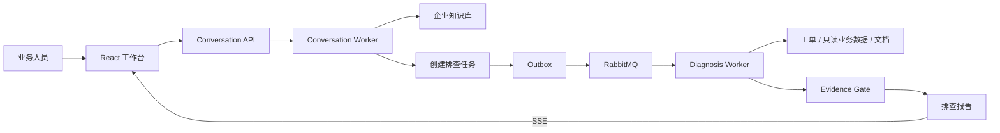

## Architecture

| Layer | Components |
| --- | --- |
| Web | React 19, TypeScript, Vite, TanStack Query, Tailwind CSS 4 |
| API | Go 1.25, Gin, GORM, Eino, Zap |
| Data | PostgreSQL 16 + pgvector, SQL Server 2022, Redis 7 |
| Messaging | RabbitMQ, transactional Outbox, diagnosis/conversation/knowledge/memory workers |
| Object storage | MinIO |
| Knowledge processing | Office/PDF parsing, embedding, reranking, optional ONNX Runtime layout routing |
| Observability | OpenTelemetry, optional self-hosted Langfuse |

详细的服务职责、数据流和故障边界见 [系统架构](docs/design/system-architecture.md)。

## Quick start

### Prerequisites

- Docker Desktop with Docker Compose
- PowerShell 7（执行仓库脚本时）
- Go 1.25.3 和 Node.js 22+（仅本地开发需要）

### Start with Docker Compose

```powershell
Copy-Item .env.compose.example .env
docker compose up -d --build
```

创建本地管理员账号：

```powershell
$env:MESGUARD_INITIAL_USER_PASSWORD = "replace-with-a-local-password"
docker exec `
  -e MESGUARD_INITIAL_USER_PASSWORD `
  mesguard-api `
  ./mesguard-user `
  -username demo-admin `
  -display-name "Demo Admin" `
  -role admin
```

启动完成后访问：

| Service | URL |
| --- | --- |
| Web | <http://127.0.0.1:5173> |
| API health | <http://127.0.0.1:9090/healthz> |
| MinIO console | <http://127.0.0.1:9001> |

需要自托管网页搜索时，使用 `web-search-self-hosted` profile：

```powershell
docker compose --profile web-search-self-hosted up -d --build
```

环境变量、Provider 配置、Worker 重建和本地前端开发命令统一维护在 [开发指南](docs/development.md)。

## Configuration

- [`.env.compose.example`](.env.compose.example) 定义 Docker Compose 使用的端口、初始账号和基础设施凭据变量。
- [`config/mesguard.toml`](config/mesguard.toml) 是本地开发配置。
- [`config/mesguard.docker.toml`](config/mesguard.docker.toml) 是容器运行配置。
- Web Search、OCR/VLM、Embedding 和 Rerank 依赖外部 Provider；未配置时按对应降级路径运行。
- 仓库中的默认值仅用于本地开发。部署到其他环境前必须替换密码、密钥、域名和存储配置。

## Verification

```powershell
go test ./...

Set-Location web
npm ci
npm run build
```

项目将可复现评测与前后端联调记录分开维护：

- [评测索引](docs/evaluations/README.md)：固定数据集、方法、结果及适用边界。
- [统一助手全链路验收](docs/testing/full-chain-acceptance-2026-08-22.md)：知识问答、工具活动、任务创建、Evidence Gate 和工单卷宗联调。
- [会话工具活动验收](docs/testing/unified-chat-tool-activity-2026-08-22.md)：回答来源、工具摘要、重试和缓存路径。

这些结果来自本地受控环境，不代表生产 SLA。

## Project status

当前版本已打通会话、知识入库与检索、工单排查任务、异步 Worker、报告和前端工作台。仍需注意以下边界：

- 复杂根因调查依赖数据目录、只读业务数据和企业资料的覆盖度；证据不足时报告会提前结束。
- 部分外部 Provider 能力需要单独配置密钥和网络访问。
- 当前观测与评测数据来自固定本地环境，不能直接外推到生产负载。
- 生产部署仍需补充告警、备份、密钥管理、数据保留和高可用配置。

最新实现状态与后续计划见 [Roadmap](docs/roadmap.md)。

## Documentation

- [文档索引](docs/README.md)
- [产品与工作流](docs/design/product-and-workflow.md)
- [Agent 编排与工具治理](docs/design/agent-orchestration.md)
- [API 与 SSE 契约](docs/design/api.md)
- [数据库设计](docs/design/database.md)
- [知识入库与检索](docs/design/rag-ingestion-and-retrieval.md)
- [前端设计](docs/design/frontend.md)
- [Agent 可观测性](docs/design/agent-observability.md)

## License

MESGuard is available under the [MIT License](LICENSE).

仓库内的演示账号、ERP 工单和知识资料均为本地合成或公开测试数据，不包含真实客户信息和生产密钥。
