# MESGuard · 工业软件智能诊断与知识问答 Agent

<div align="center">

> **MESGuard** 是一个面向工业软件场景的证据驱动诊断 Agent：把 ERP/MES 工单、只读业务数据、企业知识文档和会话上下文组织成**可追溯、可审计、有引用**的智能诊断与问答闭环。

[](https://go.dev/)
[](https://github.com/gin-gonic/gin)
[](https://react.dev/)
[](https://www.postgresql.org/)
[](https://www.rabbitmq.com/)
[](https://min.io/)
[](LICENSE)

开发语言：Go + TypeScript/React ｜ 运行环境：Docker Compose 一键启动 ｜ 状态：前后端真实联调可用

</div>

---

## 🖥️ 界面演示（真实运行截图）

打开仓库就能"看见"系统长什么样。以下截图全部来自 **真实前后端联调环境**（Vite 前端 + 本地 API + PostgreSQL/RabbitMQ/MinIO + 异步 Worker），不是原型图。

### 会话助手：流式回答 · 附件 · 知识引用

<p align="center">
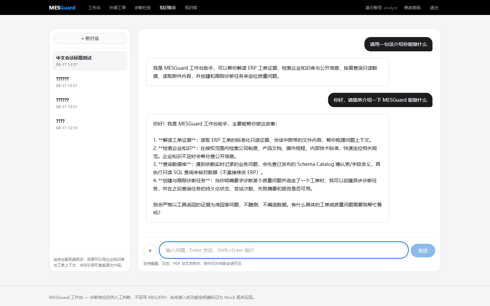
</p>

向企业知识库提问时，回答会**引用原文**，点击引用即可打开原文预览：

<p align="center">
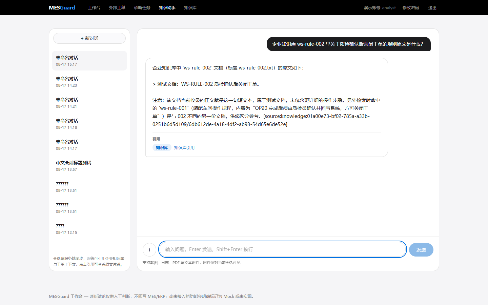
</p>

<p align="center">
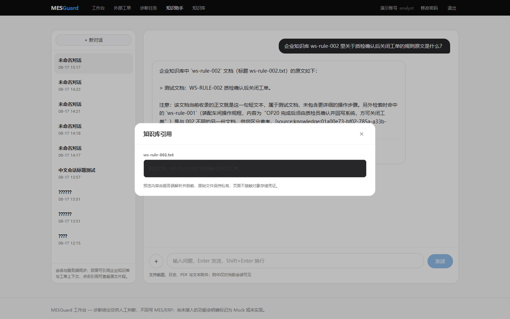
</p>

### 诊断工作台与异步任务

从工单发起诊断 → 后台 Worker 执行 → 前端实时展示进度与结果：

<p align="center">
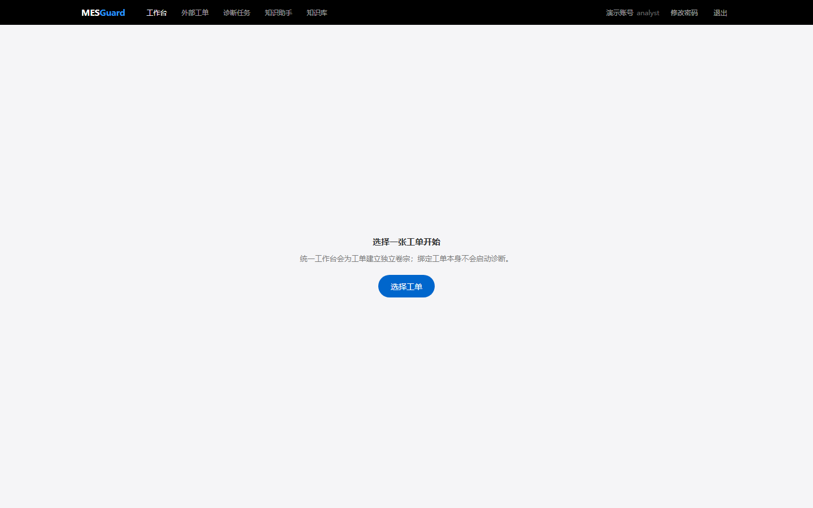
</p>

<p align="center">
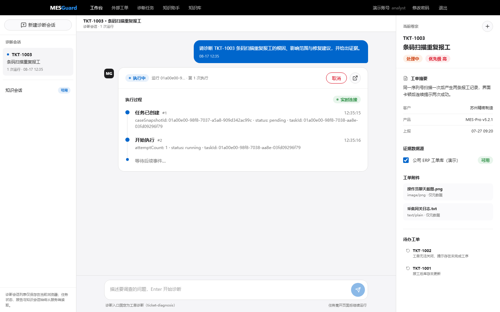
</p>

任务详情页提供完整时间线、证据明细与正式报告：

<p align="center">
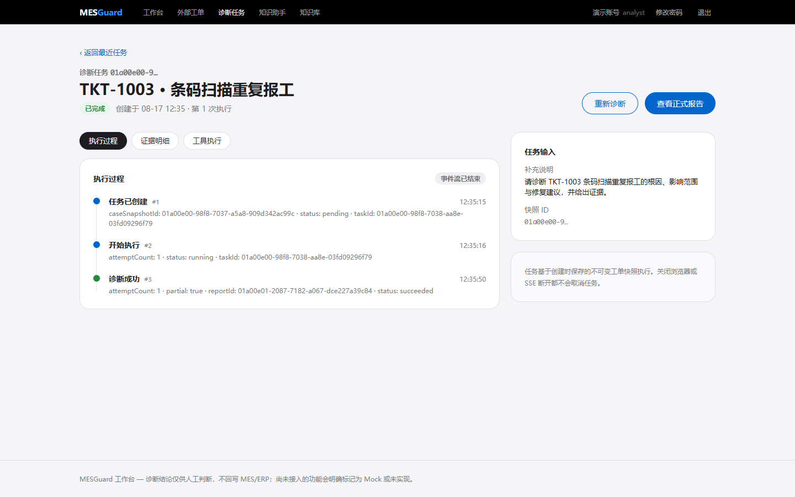
</p>

<p align="center">
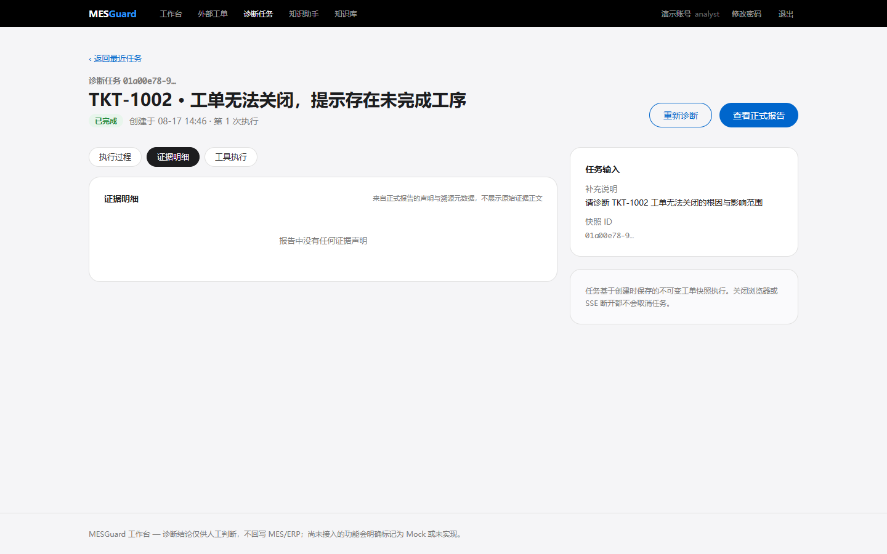
</p>

<p align="center">
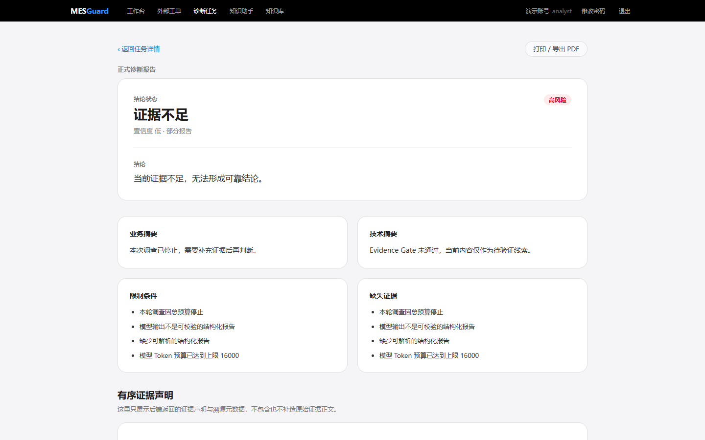
</p>

### 打开看看吧（更多页面）

<details>
<summary>点击展开：工单列表 / 任务筛选 / 知识库 / 复核记录</summary>

外部工单列表（来源指纹、数据源切换）：

<p align="center">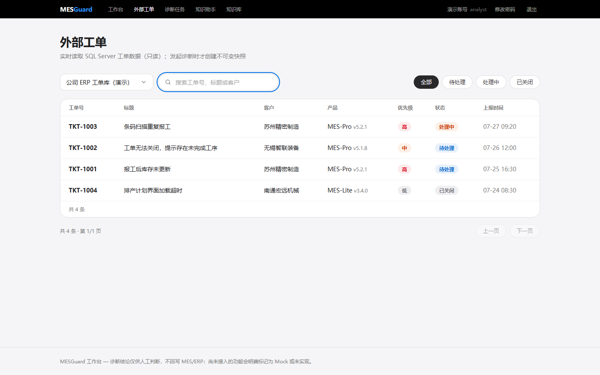</p>

诊断任务列表（状态筛选、任务 ID 直开）：

<p align="center">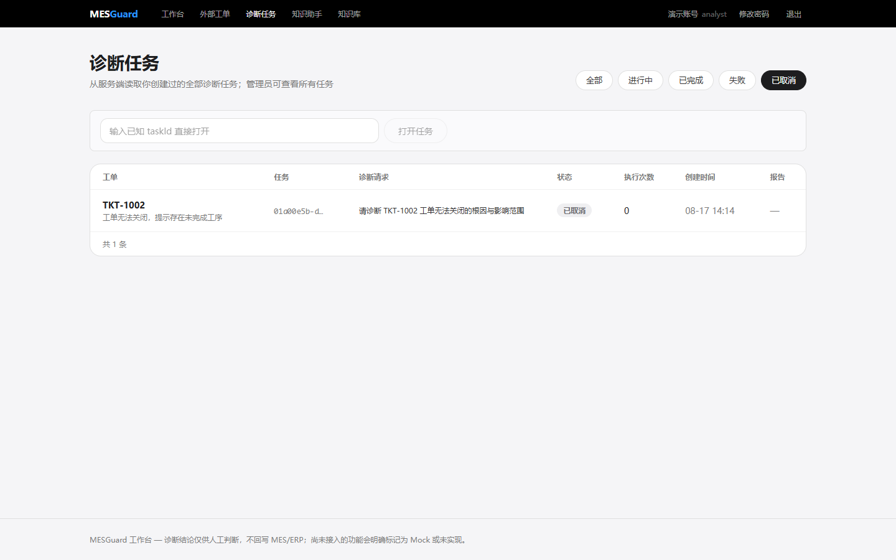</p>

企业知识库（文档版本、解析任务进度）：

<p align="center">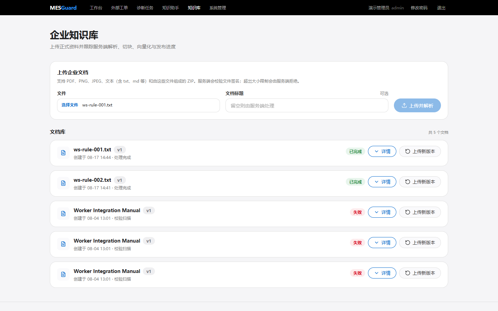</p>

人工复核记录（管理员视角）：

<p align="center">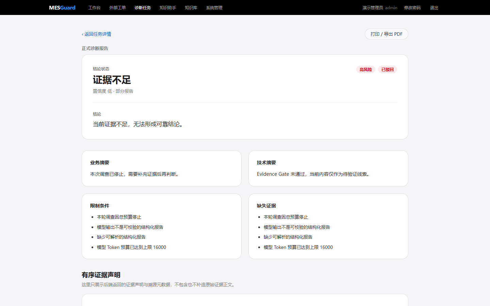</p>

</details>

---

## ✨ 它能做什么

- **统一 Agent 运行时与权限治理**：Conversation 与 Diagnosis 共用固定 Tool Profile，执行期通过 `RunAccess`、`ResourceGrant` 和诊断任务冻结的 `InvestigationPolicy` 双重门禁，模型能力与执行权限分离。
- **可审计的异步诊断任务**：工单快照、附件快照、Outbox、RabbitMQ Worker、租约 fencing、幂等、取消、重试、报告与人工复核全部持久化，SSE 实时推送任务时间线。
- **安全 Text-to-SQL**：Schema Catalog 白名单 + SQL 静态检查（QueryGuard）+ 只读账号 + 超时/行数限制，层层防护后才允许模型查询 ERP/MES 数据库。
- **文档知识库与可追溯 RAG**：多格式文档解析（文本/Office/PDF）、版本化入库、Embedding + FTS/Vector/RRF 混合召回、引用绑定原文与页码、点击即预览。
- **会话助手**：会话消息持久化，异步 Worker 生成回答并**分块流式推送**（SSE `turn_message_delta`），支持附件上传与知识/附件/网页三类引用。
- **前后端真实联调**：React 工作台（React 19 + TanStack Query + Tailwind 4）直接对接 Go API，未实现的能力显示诚实空态，不用 Mock 冒充实现。

## 🤔 为什么需要它

- 工业售后/实施场景里，故障排查依赖人工翻阅工单、查库、查文档，结果不可追溯、复用率低。
- 让 Agent 带着**冻结的权限和引用证据**去调查：每一步都有依据，每一份报告都能回查。
- 演示环境使用合成 ERP 数据，可一键 Docker 启动完整链路，适合作为可运行的作品集项目。

## 🏗️ 技术架构

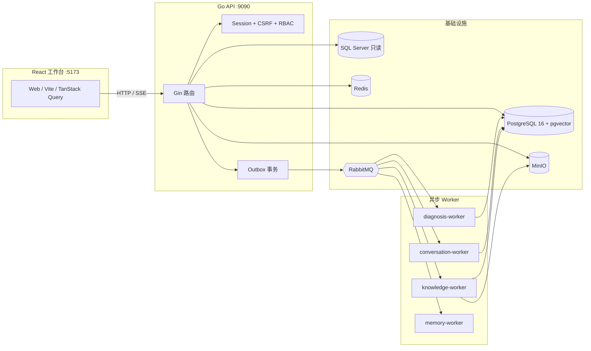

### 技术栈

| 层 | 选型 |
| --- | --- |
| 后端 | Go 1.25 · Gin · GORM · Eino (Agent 编排) · Zap |
| 数据 | PostgreSQL 16 + pgvector · SQL Server 2022 · Redis 7 |
| 异步 | RabbitMQ · Outbox 模式 · 多 Worker（诊断/会话/知识/记忆） |
| 存储 | MinIO（附件与知识源对象） |
| 前端 | React 19 · TypeScript · Vite · TanStack Query · Tailwind CSS 4 |
| 其他 | ONNX Runtime（版式路由）· OpenTelemetry · 可选 LLM/Embedding/Rerank Provider |

## 🚀 快速开始（看完就能跑）

需要：Go 1.25.3、Node.js 22+、Docker Desktop。

```powershell
# 1. 准备环境变量（全空也能启动，Agent 能力降级）
Copy-Item .env.compose.example .env

# 2. 构建并同步重建完整 Docker 应用链路（API、迁移、relay、四类 worker、SearXNG）
.\scripts\runtime\rebuild_docker_app.ps1  # API: http://127.0.0.1:9090

# 3. 另开终端启动前端
cd web
npm install
npm run dev                              # http://127.0.0.1:5173

# 4. 在 Docker API 容器中创建账号（密码只走环境变量）
$env:MESGUARD_INITIAL_USER_PASSWORD = "change-this-locally"
docker exec -e MESGUARD_INITIAL_USER_PASSWORD mesguard-api ./mesguard-user -username demo-admin -display-name "Demo Admin" -role admin
```

完整 Worker 链路与更多命令见 [开发指南](docs/development.md)。

## 🧪 评测与证据

项目内沉淀了固定数据集评测与受控 Smoke：工具选择、安全 Text-to-SQL、RAG 检索、文档解析吞吐、证据门禁等均有可复现方法与结果记录（详见 [评测索引](docs/evaluations/README.md)）。所有数字均标注固定本地数据集范围，**不冒充生产 SLA**。

## 📚 文档

- [文档总览](docs/README.md) — 设计、决策、评测索引
- [系统架构](docs/design/system-architecture.md) · [Agent 编排](docs/design/agent-orchestration.md)
- [API 与 SSE 契约](docs/design/api.md) · [数据库设计](docs/design/database.md)
- [知识入库与检索](docs/design/rag-ingestion-and-retrieval.md) · [前端设计](docs/design/frontend.md)

## 📄 许可证

本项目基于 **MIT 许可证**开放（见 [LICENSE](LICENSE)）。

> 演示环境使用**合成数据**（ERP、账号、工单、文档均为本地构造），不含任何真实客户信息与真实密钥；请勿将演示配置用于生产环境。